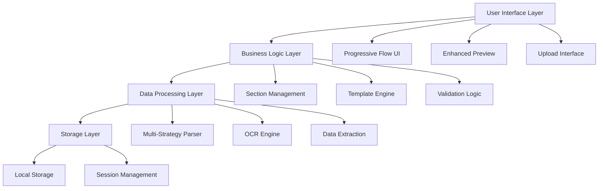

# Design Document

## Overview

This design document outlines the comprehensive enhancements to the resume builder application to address PDF parsing issues, improve data accuracy, enhance UI/UX design, and implement a progressive completion flow with visual indicators. The solution focuses on creating a robust, user-friendly resume building experience that handles various file formats reliably and guides users through the process intuitively.

## Architecture

### Current System Analysis

The current resume builder consists of:
- **BuilderNew.tsx**: Main builder component with modular architecture
- **ResumeUpload.tsx**: File upload and parsing interface
- **EnhancedResumeParser.ts**: PDF/document parsing service
- **Builder components**: Modular sections for different resume parts
- **Template system**: Multiple resume templates with customization

### Enhanced Architecture



## Components and Interfaces

### 1. Enhanced PDF Parser Service

**Multi-Strategy Parsing Architecture:**
```typescript
interface ParsingStrategy {
  name: string;
  priority: number;
  canHandle: (file: File) => boolean;
  parse: (file: File, onProgress?: ProgressCallback) => Promise<string>;
}

interface EnhancedParserConfig {
  strategies: ParsingStrategy[];
  fallbackOptions: FallbackOption[];
  ocrSettings: OCRConfiguration;
  validationRules: ValidationRule[];
}
```

**Key Improvements:**
- Multiple parsing strategies with fallback mechanisms
- Enhanced OCR with preprocessing for image-based PDFs
- Better error handling and user feedback
- Support for password-protected PDFs with user guidance
- Improved text extraction accuracy

### 2. Intelligent Data Section Placement

**Section Classification System:**
```typescript
interface SectionClassifier {
  patterns: RegExp[];
  keywords: string[];
  contextualRules: ContextRule[];
  confidence: number;
}

interface DataPlacementEngine {
  classifiers: Record<SectionType, SectionClassifier>;
  extractionRules: ExtractionRule[];
  validationLogic: ValidationLogic;
}
```

**Features:**
- Machine learning-inspired pattern matching
- Context-aware section identification
- Confidence scoring for placement decisions
- Manual override options for uncertain placements

### 3. Progressive Completion Flow UI

**Flow State Management:**
```typescript
interface ProgressionState {
  sections: SectionProgress[];
  currentSection: number;
  completionPercentage: number;
  visualState: VisualFlowState;
}

interface SectionProgress {
  id: string;
  name: string;
  status: 'not_started' | 'in_progress' | 'completed';
  required: boolean;
  validationErrors: string[];
}
```

**Visual Flow Component:**
```typescript
interface ProgressFlowProps {
  sections: SectionProgress[];
  currentSection: number;
  onSectionClick: (index: number) => void;
  showConnectingLines: boolean;
  animationEnabled: boolean;
}
```

### 4. Enhanced Preview System

**Preview Container Architecture:**
```typescript
interface PreviewSystem {
  container: PreviewContainer;
  scaleManager: ScaleManager;
  templateRenderer: TemplateRenderer;
  realTimeUpdater: RealTimeUpdater;
}

interface PreviewContainer {
  fixedHeight: boolean;
  scrollable: boolean;
  responsive: boolean;
  zoomControls: boolean;
}
```

## Data Models

### Enhanced Resume Data Structure

```typescript
interface EnhancedResumeData extends ResumeData {
  metadata: {
    sourceFile?: FileMetadata;
    parsingMethod: string;
    confidence: number;
    lastModified: Date;
    version: string;
  };
  
  validation: {
    errors: ValidationError[];
    warnings: ValidationWarning[];
    completeness: number;
  };
  
  sections: {
    [key: string]: {
      data: any;
      status: SectionStatus;
      lastUpdated: Date;
    };
  };
}
```

### Progress Tracking Model

```typescript
interface ProgressTracker {
  sessionId: string;
  userId?: string;
  sections: SectionProgress[];
  overallProgress: number;
  timeSpent: number;
  lastActiveSection: number;
  autoSaveEnabled: boolean;
}
```

## Error Handling

### Comprehensive Error Management

**Error Categories:**
1. **File Processing Errors**
   - Invalid file format
   - Corrupted files
   - Password-protected files
   - Oversized files

2. **Parsing Errors**
   - OCR failures
   - Text extraction issues
   - Section identification failures
   - Data validation errors

3. **UI/UX Errors**
   - Network connectivity issues
   - Browser compatibility problems
   - Performance degradation

**Error Recovery Strategies:**
```typescript
interface ErrorRecoveryStrategy {
  errorType: string;
  recoveryActions: RecoveryAction[];
  userGuidance: string;
  fallbackOptions: string[];
}
```

### User-Friendly Error Messages

```typescript
const ERROR_MESSAGES = {
  PDF_PASSWORD_PROTECTED: {
    title: "Password Protected PDF",
    message: "This PDF requires a password. Please provide an unlocked version.",
    actions: ["Try different file", "Remove password", "Contact support"]
  },
  
  PDF_IMAGE_BASED: {
    title: "Image-Based PDF Detected",
    message: "This PDF contains scanned images. We'll use OCR to extract text.",
    actions: ["Continue with OCR", "Upload text-based version"]
  },
  
  INSUFFICIENT_TEXT: {
    title: "Limited Text Found",
    message: "We found very little text in your resume. Please check the file quality.",
    actions: ["Try again", "Upload different format", "Manual entry"]
  }
};
```

## Testing Strategy

### Comprehensive Testing Approach

**1. File Format Testing**
- Test with various PDF types (text-based, image-based, mixed)
- Test with different Word document versions
- Test with corrupted and edge-case files
- Performance testing with large files

**2. Parsing Accuracy Testing**
- Create test suite with known resume formats
- Validate extraction accuracy across different layouts
- Test section identification reliability
- Measure confidence scoring accuracy

**3. UI/UX Testing**
- Progressive flow navigation testing
- Visual indicator state management
- Responsive design validation
- Accessibility compliance testing

**4. Integration Testing**
- End-to-end resume building workflow
- Template switching with preserved data
- Auto-save and recovery functionality
- Cross-browser compatibility

### Test Data Sets

```typescript
interface TestDataSet {
  name: string;
  files: TestFile[];
  expectedResults: ExpectedResult[];
  testScenarios: TestScenario[];
}

interface TestFile {
  path: string;
  type: 'pdf' | 'docx' | 'image';
  characteristics: string[];
  expectedChallenges: string[];
}
```

## Performance Optimization

### Parsing Performance

**Optimization Strategies:**
1. **Lazy Loading**: Load parsing libraries only when needed
2. **Worker Threads**: Use web workers for heavy parsing operations
3. **Caching**: Cache parsed results for repeated uploads
4. **Progressive Processing**: Show progress and allow cancellation

### UI Performance

**Optimization Techniques:**
1. **Virtual Scrolling**: For large resume previews
2. **Debounced Updates**: Reduce re-renders during editing
3. **Memoization**: Cache expensive computations
4. **Code Splitting**: Load components on demand

## Security Considerations

### File Upload Security

**Security Measures:**
1. **File Type Validation**: Strict file type checking
2. **Size Limits**: Prevent DoS attacks through large files
3. **Content Scanning**: Basic malware detection
4. **Sandboxed Processing**: Isolate file processing

### Data Privacy

**Privacy Protection:**
1. **Local Processing**: Keep sensitive data client-side
2. **Temporary Storage**: Clear uploaded files after processing
3. **No Server Upload**: Process files entirely in browser
4. **User Consent**: Clear privacy policy and data handling

## Accessibility Features

### WCAG 2.1 AA Compliance

**Accessibility Enhancements:**
1. **Keyboard Navigation**: Full keyboard support for all interactions
2. **Screen Reader Support**: Proper ARIA labels and descriptions
3. **High Contrast Mode**: Support for high contrast themes
4. **Focus Management**: Clear focus indicators and logical tab order
5. **Alternative Text**: Descriptive text for all visual elements

### Progressive Enhancement

**Inclusive Design:**
1. **Graceful Degradation**: Fallback options for limited browsers
2. **Reduced Motion**: Respect user motion preferences
3. **Font Scaling**: Support for user font size preferences
4. **Color Independence**: Don't rely solely on color for information

## Implementation Phases

### Phase 1: Enhanced PDF Parser (Priority: High)
- Implement multi-strategy parsing
- Add comprehensive error handling
- Improve OCR capabilities
- Test with problematic files like resume(7).pdf

### Phase 2: Data Placement Intelligence (Priority: High)
- Develop section classification system
- Implement confidence scoring
- Add manual override capabilities
- Create validation feedback system

### Phase 3: Progressive Flow UI (Priority: Medium)
- Design visual flow component
- Implement section status tracking
- Add connecting line animations
- Create responsive design

### Phase 4: Preview Enhancement (Priority: Medium)
- Redesign preview container
- Implement proper scaling
- Add zoom controls
- Optimize for performance

### Phase 5: Polish and Testing (Priority: Low)
- Comprehensive testing suite
- Performance optimization
- Accessibility audit
- User experience refinement